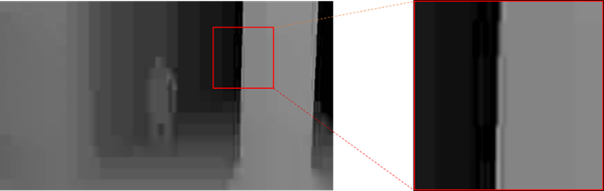
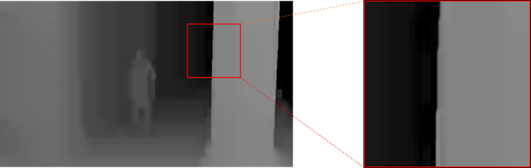
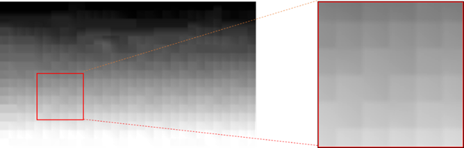
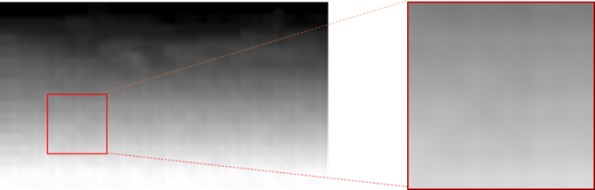

## Overview
This is a tensorflow implementation of ["Low-complexity two-step lossless depth coding using coarse Lossy coding"]( https://doi.org/10.1007/s11042-022-12145-2), a deep learning based Depth-Image Super-Resolution (SISR) model.

This network is used to unsample and enhance quality of compressed depth image in VVC.
This model is based on DCSCN, a Single-Image Super-Resolution

We also implemented these features.

* __Pixel Shuffler__ from ["Real-Time Single Image and Video Super-Resolution Using an Efficient Sub-Pixel Convolutional Neural Network"
](https://arxiv.org/abs/1609.05158)

* __Self Ensemble__ from ["Seven ways to improve example-based single image super resolution"](https://arxiv.org/abs/1511.02228)

## Sample result

| Input image and x2 bicubic | Our proposed output |
|:-------:|:-------:|
| | |
| | |


## Requirements

python >= 3.6
tensorflow >= 2.1.0, scipy, numpy, pillow, imageio, and scikit-image


## Result of PSNR

The sample result of default parameter is here. The model is trained by custom depth dataset.

| Dataset | Scale | Bicubic | Propsed | 
|:-------:|:-------:|:-------:|:-------:|
|  Undo_dance| x2 | 35.74 | **36.76** | 
|  FT_Fly| x2 | 37.37| **38.64** | 


## Apply to your own image
 
Execute **sr.py** with the input images in input_dir you get results in **output_dir** directory.
The model is fixed. Please don't change any things.

The pre-trained model is included in models directory.

```
# evaluating set14 dataset
python .\sr.py --input_dir=./data/QP51 --output_dir=data/QP51test/
```

## How to train with your own dataset
The orginal dataset you can download from ["Here"](https://drive.google.com/file/d/1Jgm-8zvSXmw1UkWXNkpZT7sU88tueUGC/view?usp=sharing).

You can train with any datasets. Put your image files as a training dataset into the directory under **data** directory. 
Modify **helper/args.py** in 2 argument **dataset** for output high quality images, and **dataset_in** for input compressed low-resolution images.

```
# training for x2 with custom dataset
python3 train.py

```


# Important parameters

The number of filter is fixed **num_feat_in = np.array([32, 32, 16, 16, 16, 8, 8])** in line 262 file **DCSCN.py**.
If your want to change model, please modify it.

The name is based on arg file. Don't forget to modify it too.

